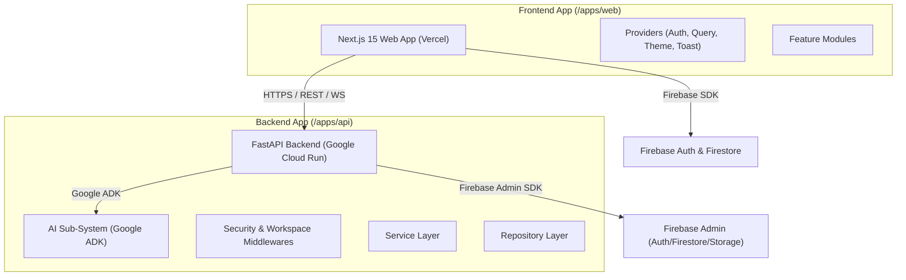

# FounderHQ System Architecture

## Overview

FounderHQ adopts a modern, highly decoupled architecture designed to scale seamlessly from MVP to enterprise usage.

---

## 1. High-Level Architecture

---

## 2. Monorepo Principles

1. **Single Source of Truth**: All TypeScript types, schemas, and styling components reside in `/packages`.
2. **Separation of Concerns**: Business logic is isolated in FastAPI backend services (`apps/api`); presentation logic lives in Next.js (`apps/web`).
3. **Clean Architecture**: Backend follows Router -> Service -> Repository layers with Dependency Injection.
4. **Zero Magic Strings**: Enums and constants are shared via `packages/types` and `packages/shared`.

---

## 3. Frontend Architecture (Next.js 15)

- **App Router**: Route groups `(auth)`, `(dashboard)`, `(marketing)`.
- **State Management**: TanStack Query v5 for server state, React Hook Form + Zod for form state.
- **Styling**: Tailwind CSS + shadcn/ui primitives + Framer Motion animations.
- **Resilience**: Global Error Boundaries, Skeletons, Suspense, fallback 404/500 UI.

---

## 4. Backend Architecture (FastAPI + Python 3.12)

- **Dependency Injection**: FastAPI `Depends` for service & repository instantiation.
- **Validation**: Pydantic v2 schemas for request input and response output serialization.
- **Middleware Chain**: Security Headers -> CORS -> JWT Verification -> Tenant Workspace Isolation -> Rate Limiter.
- **Health Checks**: Standard `/healthz` (liveness) and `/readyz` (readiness) probes.

---

## 5. Security & Isolation

- **Multi-Tenant Context**: Every backend request extracts `workspace_id` from verified token claims or request headers.
- **RBAC Enforcement**: Roles (Owner, Admin, Member, Guest) checked at service level.
- **Secrets Management**: Loaded exclusively through environment variables validated at startup.
